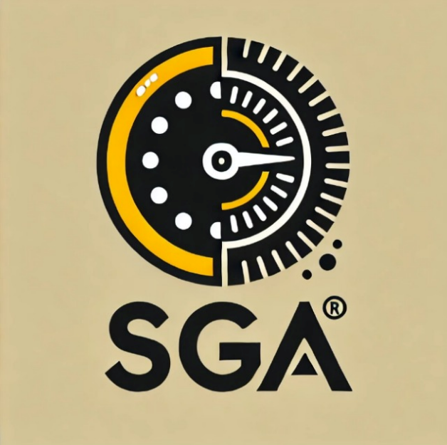

# SGA - Sistema de gerenciamento de auto-escola

O objetivo do SGA - Sistema de gerenciamento de auto-escola é facilitar os processos envolvidos na gestão de uma auto-escola, com o foco na comunicação entre empresa, professor e aluno. A ideia do grupo surgiu de observações dos próprios integrantes, uma vez que todos realizaram a obtenção da CNH no último ano e notaram o quão rudimentar e confuso era o ambiente da auto-escola, visto que a comunicação era falha, as aulas eram frequentemente remarcadas e muitas vezes os alunos tinham que entrar em contato todos os dias com os professores para marcar o horário de aula, o que é ruim para todas as partes envolvidas. 
Portanto, o objetivo do nosso projeto é fazer com que a auto-escola consiga operar de uma maneira mais fácil e eficaz, trazendo assim benefícios para os alunos, professores e gestores da organização. 

## Integrantes

* Athur Candian 
* Arthur Henrique Santana Pedra
* Gabriel Chagas Lage
* Luiz Felipe Gontijo Soares
* Pedro Porto Ramalho
* Thiago Cury Freire
* Vinícius Paranho Ribeiro 

## Professor

* Alexandre
* Danilo Boechat Seufitelli
* Michelle Hanne Soares de Andrade

## Instruções de utilização

Assim que a primeira versão do sistema estiver disponível, deverá complementar com as instruções de utilização. Descreva como instalar eventuais dependências e como executar a aplicação.

## Histórico de versões

* 0.1.1
    * CHANGE: Atualização das documentações. Código permaneceu inalterado.
* 0.1.0
    * Implementação da funcionalidade X pertencente ao processo P.
* 0.0.1
    * Trabalhando na modelagem do processo de negócio.

